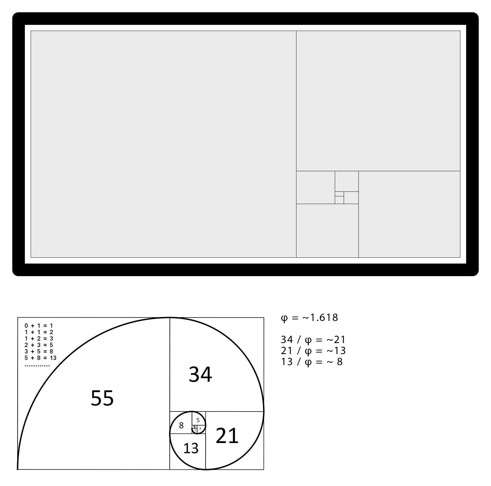

# Golden Spiral

> Zasada złotego podziału, znana jest już od starożytności i wykorzystywana w przeróżnych dziedzinach, takich jak architektura, malarstwo czy projektowanie. Założenia złotego podziału sprowadzają się do zachowania proporcji między długością dłuższego i krótszego boku prostokąta.

[https://grafmag.pl/artykuly/zloty-podzial-czyli-odrobina-geometrii-w-projektowaniu](https://grafmag.pl/artykuly/zloty-podzial-czyli-odrobina-geometrii-w-projektowaniu)

Zakoduj layout tak, aby wyglądał jak makieta poniżej:

