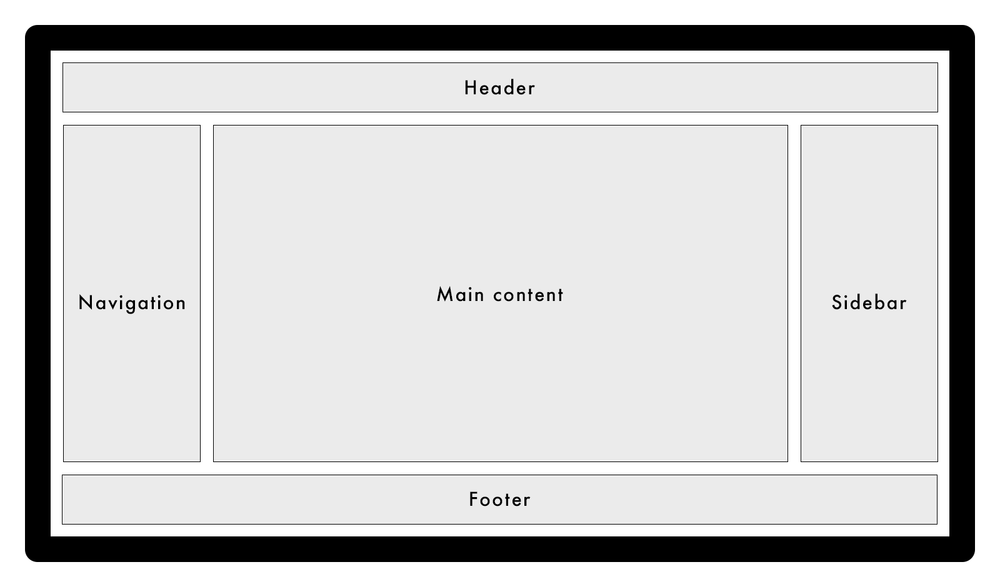

# Holy Grail

Klasyczny layout złożony z headera, footera i trzech kolumn. Środkowa kolumna zawiera główną treść strony, podczas gdy lewa i prawa zawierają treść uzupełniającą (np. nawigację lub reklamy).

Zakoduj layout na wzór makiety poniżej:

### Zadanie 1
Zakoduj layout tak, żeby:
1. każda kolumna miała szerokość równą 1/3 szerokości ekranu,
2. odstępy między kolumnami wynosiły `20px`,
3. odstępy między wierszami wynosiły `40px`.

### Zadanie 2
Zakoduj layout tak, żeby:
1. szerokość kolumny `Navigation` wynosiła zawsze tyle, ile najszerszy element w niej umieszczony,
2. pozostałe kolumny wypełniły po równo resztę wolnego miejsca na ekranie,
3. odstępy między kolumnami i wierszami wynosiły dwukrotność rozmiaru fonta ustawionego dla elementu `body`.

### Zadanie 3
Zakoduj layout tak, żeby:
1. szerokość kolumny `Main content` zajmowała 3/5 szerokości ekrany,
2. pozostałe kolumny wypełniły po równo resztę wolnego miejsca na ekranie.