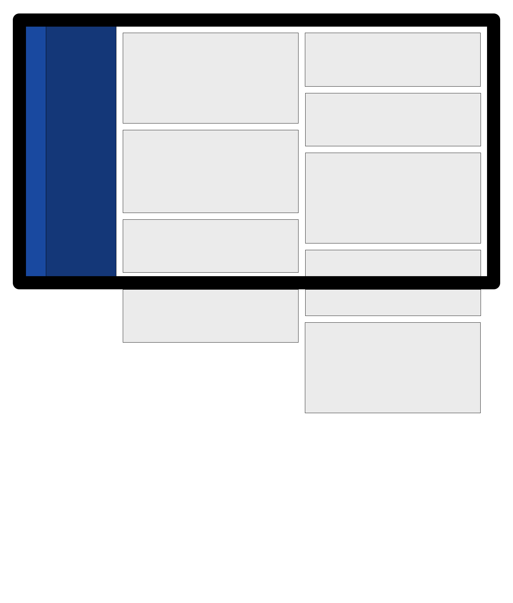

# Jira Dashboard

Layout obecny w nowym dashboardzie Jiry. Po lewej nawigacja, składająca się z dwóch kolumn. Po prawej lista widgetów tworząca układ znany jako [masonry](https://www.sitepoint.com/understanding-masonry-layout/), w którym, mimo różnej wysokości elementów, marginesy na około pozostają spójne.

Zakoduj layout tak, aby wyglądał jak makieta poniżej. Szarym elementom możesz nadać losową wysokość, lub uzupełnić je tekstem (np. [lorem ipsum](https://lipsum.com)).

