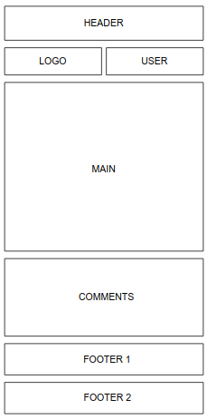
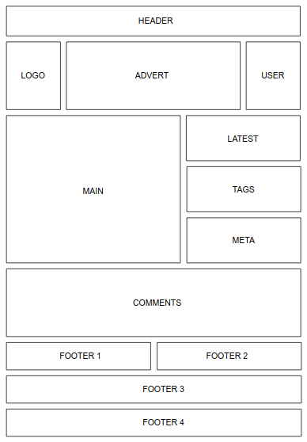
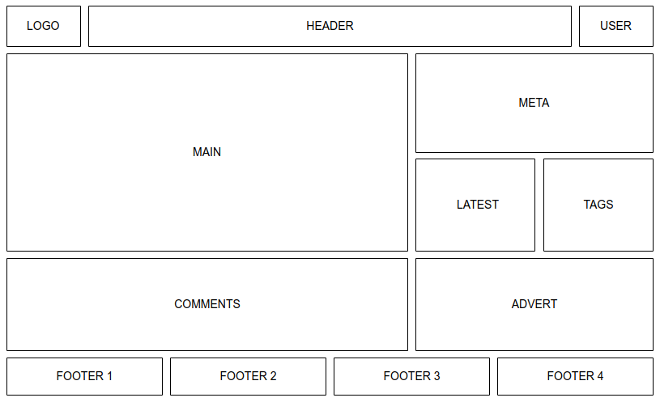

# RWD

> Responsive web design (RWD) – technika projektowania strony www, tak aby jej wygląd i układ dostosowywał się automatycznie do rozmiaru okna przeglądarki, na której jest wyświetlany np. przeglądarki, smartfonów czy tabletów. Strona tworzona w takiej technice jest uniwersalna i wyświetla się dobrze zarówno na dużych ekranach, jak i na smartfonach czy tabletach.

Zakoduj layout na wzór makiet poniżej dla zadanych szerokości ekranu.

## max. 320px

## 321px - 786px

## min. 786px

