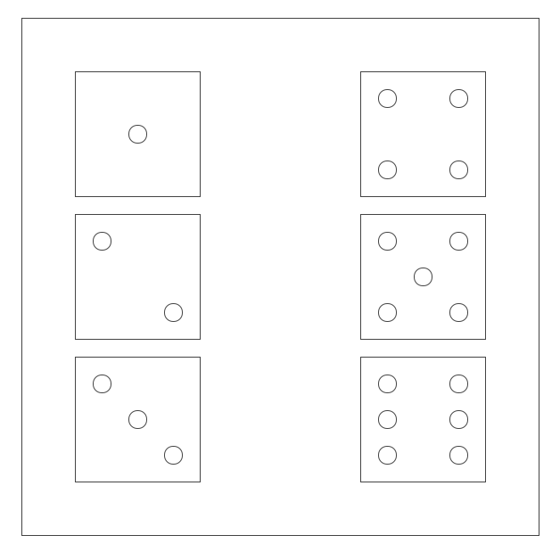

# Yathtzee

Yathtzee to popularna gra dla 2-4 osób, w której gracze rzucają pięcioma typowymi sześciennymi kostkami.

Zakoduj layout na wzór makiety poniżej:

## Zadanie 1
Zakoduj layout używając CSS Grida.

## Zadanie 2
Zakoduj layout używając Felxboxa.
